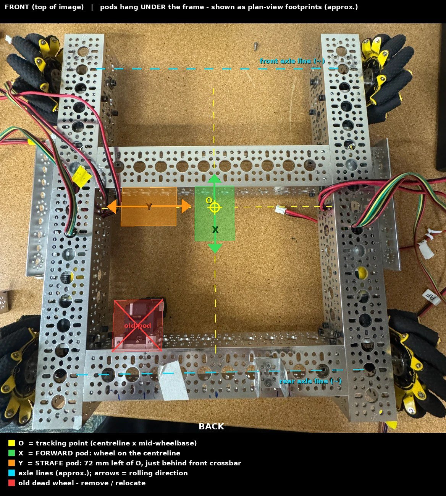
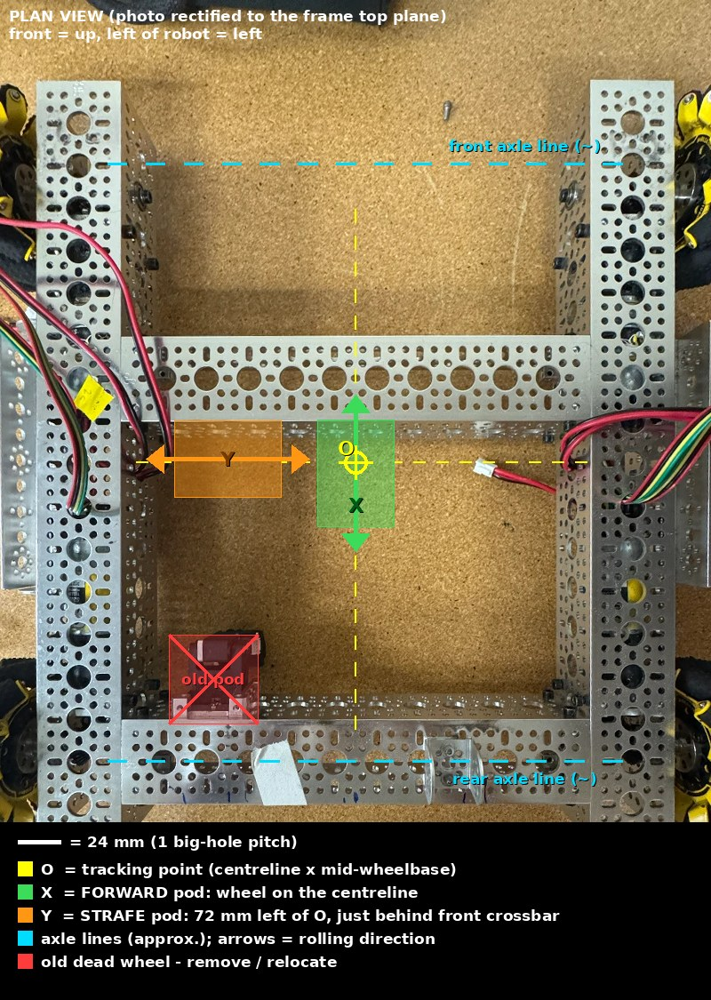

# Odometry: dead-wheel placement (bare chassis)

Two goBILDA odometry pods + goBILDA Pinpoint, used by Pedro Pathing
(`TeamCode/.../pedroPathing/Constants.java`).





## Where the pods go

Frame coordinates below are millimetres from **O**, the tracking point. **+x is forward, +y is left.**
O is the frame centreline crossed with the line midway between the front and rear axle lines.

| Pod | Measures | Wheel position | Mounting zone |
| --- | --- | --- | --- |
| **Forward pod (X)** | forward/back motion | on the centreline, y = 0 (between the two middle big holes of the crossbar) | hung behind the **front (mid-frame) crossbar**; wheel rolls fore/aft in the open bay |
| **Strafe pod (Y)** | left/right motion | x ~ 0 to +1 in, y = +72 mm (3 big-hole pitches left of centre) | hung behind the same crossbar, body left of the forward pod; wheel rolls side to side |

The old dead wheel on the rear crossbar (about 120-135 mm behind O, 70-100 mm left) comes off.

### Why here

A point on the robot at (x, y) sees this velocity when the robot turns at rate w:

- forward pod reads `vx - w*y`, so it depends only on its **sideways** offset y
- strafe pod reads `vy + w*x`, so it depends only on its **fore/aft** offset x

Pedro's names match: `forwardPodY` is the forward pod's y, `strafePodX` is the strafe pod's x.
Each pod's *other* coordinate does not enter the math. So:

- Put the forward pod on the centreline and the strafe pod on the mid-length line. Then both offsets
  are near zero and a measuring error costs almost nothing. Every 5 mm of offset error becomes about
  16 mm of position error per half-turn.
- Keep both wheels inside the drive-wheel footprint (front/rear axle lines about +/-170 mm, rail
  centrelines +/-156 mm) so they stay on the floor when the chassis pitches. The middle bay is also the least
  contested underside area while the other subsystems are built.
- The front crossbar is only ~47 mm ahead of O (centred 2 big holes ahead of the middle hole). The rear
  crossbar is ~168 mm behind O, so it is a worse home for the strafe pod (`strafePodX` ~ -6 in).

### Fallback if the front crossbar is needed by the intake

Use the rear crossbar (where the old pod is): forward pod on the centreline (`forwardPodY` ~ 0), strafe pod
left or right of it with `strafePodX` about **-6 in** (-5.7 to -6.6 in depending on where the wheel lands;
the crossbar centreline is 168 mm = 6.6 in behind O). It works, but that larger offset makes an accurate
measurement matter more.

## Pedro constants

```java
.forwardPodY(0.0)  // forward pod sideways offset from O, inches. LEFT of centre is positive.
.strafePodX(0.0)   // strafe pod fore/aft offset from O, inches. FORWARD of centre is positive.
```

Sign convention taken from the FTC SDK sample `SensorGoBildaPinpoint.java` lines 79-102 in this repo
(X/forward pod: left of centre positive. Y/strafe pod: forward of centre positive).
These are **planned** values. Replace them with tape-measured ones (below).

## Measure after mounting

1. Mark O on the frame: the centreline between the rail outer faces, and the midpoint between the front and
   rear axle centres (measure axle to axle, halve it).
2. `forwardPodY` = sideways distance from O to the centre of the forward pod's wheel (left = +).
3. `strafePodX` = fore/aft distance from O to the centre of the strafe pod's wheel (forward = +).
4. Convert mm to inches (/25.4). Pedro takes inches.

## Mounting checklist

- Forward wheel's rolling direction parallel to the robot's x axis; strafe wheel's parallel to y. Use the
  8 mm hole grid to line them up. A 2 degree misalignment leaks about 3.5 % of the other axis's motion into the reading.
- Wheel must touch the floor with the pod's spring compressed as the pod requires. Measure floor to the
  pod's mounting surface and compare it with the pod drawing; add spacers if needed.
- Keep the pod cables clear of the front-left motor cable bundle that currently crosses the left end of
  the front crossbar.
- Pinpoint on an I2C port 1-3 (never 0), configured as `pinpoint` (matches `Constants.java`).

## Verify

- Encoder directions: push the robot forward by hand, the forward pod count must rise. Push it left, the
  strafe pod count must rise (SDK sample lines 98-104). Flip `forwardEncoderDirection` /
  `strafeEncoderDirection` in `Constants.java` if not.
- Spin the robot in place several turns by hand: the reported x/y should stay put. If x/y drifts in a
  circle, an offset value or its sign is wrong.
- Push it a known distance (a metre stick or field tile edge) and compare.

## Open items

- **Which pod type?** goBILDA sells the swingarm pod (48 mm wheel) and the 4-bar pod (32 mm wheel).
  `Constants.java` does not set the encoder resolution, so it must match your pod
  (SDK sample lines 89-96: `goBILDA_SWINGARM_POD` or `goBILDA_4_BAR_POD`). Check Pedro 2.1.2's
  `PinpointConstants` for the matching builder call.
- Confirm the Pinpoint computer is fitted. If the pod encoders go to REV hub ports instead, the constants
  need a two-wheel (IMU) localizer instead. The placement above still applies.

## How the numbers were derived

Measured from the chassis photo. The channel is goBILDA U-channel (48 mm web, big holes every 24 mm).
The photo has perspective, so I fitted a homography from 33 big-hole centres on the two rails (17 holes per
rail, 312 mm apart centreline to centreline). Fit RMS was 0.7 mm.
Independent checks not used in the fit: crossbar hole pitch (24.7 mm measured vs 24), crossbar web
width (47.8 / 48.2 mm vs 48), and every crossbar hole at y = +/-12, 36, 60, 84, 108 mm (symmetric frame).
O's fore/aft position is inferred from the drive-wheel axles and is good to about +/-10 mm.
Wheel axles appear to sit on the 2nd big hole from each end of the rails (about +/-168 mm).
Treat all of this as planning accuracy and tape-measure the real mounting.
